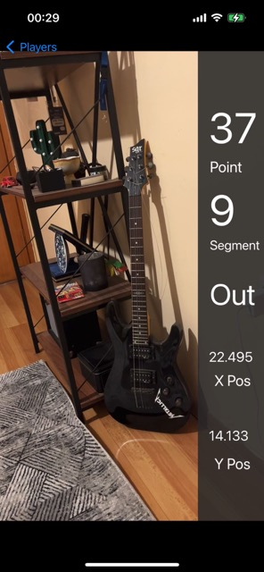

# MobileAssignment

## Introduction:

This app is a basic video recorder for player shots. After you recording a video for a corresponding shot there will be a watermark that containing information.

### In this project the libraries and methods I use are as follows:

- RealmSwift
- MediaWatermark
- Reachability
- AVFoundation

## Screens of the App

  In this screenshot below you can see the home screen for players and their **empty** shots. 
  
  And CollectionView Compositional Layout is used as interface.
  
   

  Secondly if you tap on a empty shot you can record a video about it and when the process is finished 
  The shot you selected will no longer be an empty shot and looks like below:
  
   
   
   Finally, you can watch the video you recorded and watermarked by the application by pressing the **red play button**.
   
   
